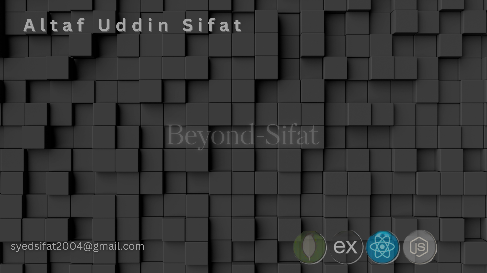

<!-- Banner -->

  

<h1 align="center">Hi 👋, I'm Altaf Uddin Sifat</h1>
<h3 align="center">Frontend-Focused MERN Stack Developer</h3>

---

### 🧑‍💻 About Me

- 🌱 I’m currently learning **Next.js and intrested to learn TypeScript**
- 🔭 I’m working on a **Sports Club management website**
- 🧠 I’m practicing **React, Firebase, MongoDB**
- ⚡ Fun fact: I love building UI from scratch!

---

### 🛠️ Skills

#### 👨‍💻 Frontend

#### 🧪 Backend & DB

#### ⚙️ Tools

---

### Projects

### 🌍 Connect with Me

---

### 📊 GitHub Stats

  

  

  

